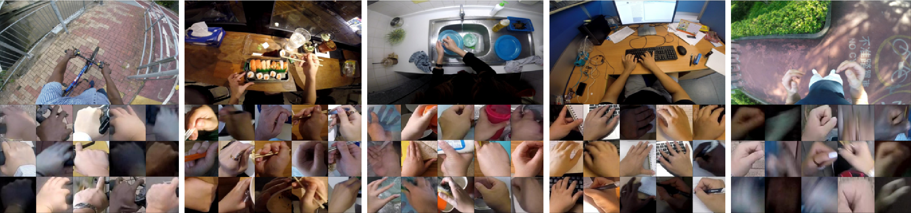

# EgoDaily
Egocentric hand detection dataset with variability on people, activities and places, to simulate daily life situations, the images can be downloaded from [here](https://drive.google.com/file/d/1FXlAUc2G0nRckcR01iHZP4RRyowSSzDh/view?usp=sharing). The dataset and testings are described in our [paper](https://doi.org/10.1016/j.imavis.2019.06.002). We provide the code to mask the ground truth in [here](https://github.com/sercruzg/YOLO-Context).

## Data Collection
### Subjects
We select 10 different subjects for recording the videos, containing people from different cultural ethnicity to add variability in skin color and hand gesture.
The dataset subjects consist of 1 subject of Hispanic descent, 1 subject of African/East Asian descent, 1 subject of European descent, and the rest from various Asian descents. We also add variability in gender by having 5 men and 6 women.



### Activities
Our dataset introduces 5 different daily-life activities, which are representative of common egocentric videos: "biking", "eating", "kitchen", "office", and "running". 

"Biking" has a person riding or interacting with a bike through real biking routes, which include passing through bridges, tunnels and streets.
"Eating" has a person eating a dish using different kitchenware, such as fork, knife and chopsticks.
"Kitchen" has a person interacting with the kitchen by making something to eat (sandwich or oatmeal) and some tea, and then doing. We also include the person 
doing the dishes. 
"Office" concentrates on the person interacting with office objects, such as typing on a computer keyboard, writing in a notebook with a pen, and using a stapler and a seal on the notebook.
"Running" has the person running through different routes, including parks, streets and football courts.

For each activity, we focus the camera view on the objects the person is interacting with: for "biking", the camera focuses on the handles; for "eating", the camera focuses on the dish the person is eating; for "kitchen", the camera focuses on the sink and the objects the person is handling; for "office", the camera focuses on the keyboard and the notebook; for running, since the hands move a lot, the camera focuses as close to the body as possible to capture the hands the most (this makes the videos for "running" to partially  neglect the road).

### Places
To have sufficient variability in background scenes, 
each recording is made in a different place as much as possible (up to the limit of availability):
9 places for  "biking", 7 for "eating", 7 for "kitchen", 7 for "office", and 10 for "running".
In total there are 40 different places for the recordings. As for the recordings that share the same place, we captured at different hours (day and night) to add variability in the background and illumination. 

### Camera
The videos were recorded by a GoPro Session 5
camera  using the ``superview`` mode that resembles the egocentric perspective the most.
This mode provides a wide field-of-view, which allows the camera to capture the wearers hands in most situations, allowing for a larger dataset.
The resolution of the recorded video is 1920$\times$1080 (1080p) at 60 frames per second. For this dataset we have 10 different subjects, doing 5 different activities, resulting in 50 unique combinations of videos. 
The average length of the videos is 7.8 minutes for each subject/activity combination, with average 470 seconds, and 29,010 frames.

### Annotations
The dataset is constructed by selecting 1,000 images uniformly from each video, resulting in 50,000 images.
The groundtruth hand bounding boxes were annotated manually containing the whole hand up to the wrist, resulting in over 95,000 annotated hands.

The annotations are in a MATLAB file with a variable "impos" with multiple fields. "im" field is the path to the image. The "boxes" field represent the top left and right bottom corner of the hand. The field "left" represents 1 if it is a left hand, 0 otherwise.

We also provide a couple of files as alternate annotations (trainEgoDaily and testEgoDaily) with the first line being the number of images following a set of lines representing each image information as follows:
```
Path
im_width im_height
# annotations
x y width height
x y width height
```

### Citing EgoDaily
If you find the EgoDaily dataset useful in your research, please consider citing:
```
@article{CRUZ2019131,
title = "Is that my hand? An egocentric dataset for hand disambiguation",
journal = "Image and Vision Computing",
volume = "89",
pages = "131 - 143",
year = "2019",
issn = "0262-8856",
doi = "https://doi.org/10.1016/j.imavis.2019.06.002",
url = "http://www.sciencedirect.com/science/article/pii/S026288561930085X",
author = "Sergio Cruz and Antoni Chan"
}
```